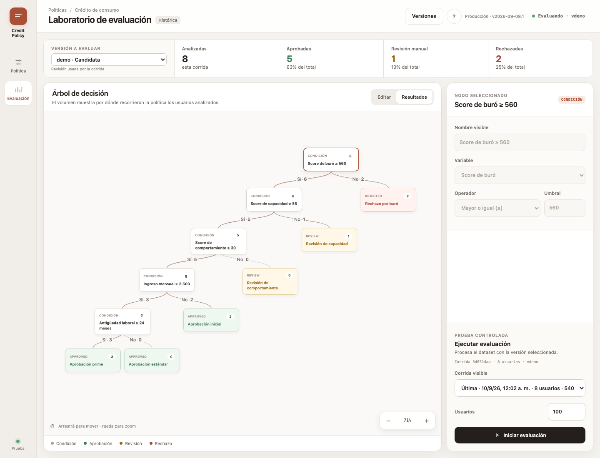
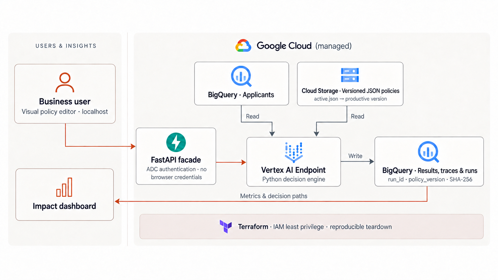

# Credit Policy Studio


Credit Policy Studio gives business teams a visual laboratory for designing, versioning, evaluating,
and promoting deterministic credit policies without writing code. Every execution remains
explainable and traceable to an exact policy version, content hash, run, and decision path.

## Why this exists

Credit decisions sit under a difficult constraint: they must be consistent, reviewable, and
explainable, while the people who understand the policy best are not always software engineers.
Deterministic decision trees support interpretability, but changing them through Python, JSON, or
deployment pipelines creates technical dependency, slows experimentation, and makes governance
harder to see.

This proof of concept closes that gap. Business users edit a protected visual policy, evaluate a
candidate against a controlled cohort, inspect where applicants flowed through the tree, and promote
it explicitly. Underneath, a production-shaped Google Cloud architecture provides immutable policy
revisions, controlled serving, least-privilege access, auditable outputs, and reproducible
infrastructure. It does not replace legal, compliance, or model-risk review; it gives those functions
clearer evidence and safer operational controls.

## Product experience

The evaluation laboratory keeps the selected policy revision, run-level metrics, and decision-path
volumes visible in one workspace. The example below uses only fictional in-memory applicants.



## How it works



The browser never receives Google Cloud credentials. Its local FastAPI facade invokes the stable
Vertex AI endpoint using Application Default Credentials; Vertex reads the selected policy and
applicant cohort, then persists the result, trace, version, and run metadata used by the impact
dashboard.

## Current POC scope

The UI runs only on the developer's computer. It is not publicly exposed and Cloud Run is not needed
for the current proof of concept.

```text
Browser
  └── localhost:8080 (HTML UI + small FastAPI facade)
          └── Vertex AI endpoint
                  ├── reads applicants from BigQuery
                  ├── loads the active JSON policy from Cloud Storage
                  ├── evaluates the complete cohort
                  ├── writes results and traces to BigQuery
                  └── returns run_id + policy version + summary
```

The browser calls only localhost. FastAPI invokes Vertex with the developer's Application Default
Credentials, so no Google Cloud token, API key, or service-account credential is embedded in HTML or
committed to this repository. The dashboard also uses the local backend to query BigQuery.

Cloud Run, scheduled jobs, and asynchronous execution are documented as future evolutions. They are
not required to demonstrate the current flow.

## GCP infrastructure at a glance

| Service | Current POC responsibility | Created now? |
| --- | --- | --- |
| Vertex AI Endpoint | Hosts the Python scoring container and starts one synchronous evaluation run per request. | Yes |
| BigQuery | Stores the synthetic applicant cohort, one result per applicant, and one audit row per run. | Yes |
| Cloud Storage | Stores candidate policies, immutable SHA-addressed revisions, and the productive pointer. | Yes |
| Artifact Registry | Stores the container image deployed to Vertex AI. | Yes |
| Cloud Build | Builds and pushes that image without requiring a local registry login. | API enabled; used by `make image` |
| IAM service account | Gives the Vertex runtime read access to policies and read/write access to the POC dataset. | Yes |
| Cloud Run | Would host the UI later; the POC intentionally keeps it on localhost. | No (`deploy_ui=false`) |
| Scheduler / Job runtime | Would automate or decouple large recurring cohorts later. | No |

Terraform also enables the required service APIs. It creates an empty Vertex endpoint, but the
billable serving replica is created only by `make deploy`. No VPC, load balancer, database,
API key, service-account key, or public web endpoint is created for the current POC.

> [!WARNING]
> Every person, score, rule, and outcome in this repository is fictional. This software is a UX and
> architecture demonstration, not a credit policy and not suitable for real lending decisions.

## AWS infrastructure at a glance

The same application also runs on AWS. `CLOUD_PROVIDER=aws` selects a second set of adapters; the
decision engine, the API contract, the policy JSON, and the UI are identical on both clouds.


Compare it with the Google Cloud diagram above: the boxes and arrows are the same, only the managed
services underneath change.

| Service | AWS responsibility | Replaces | Created now? |
| --- | --- | --- | --- |
| S3 (policies) | Immutable SHA-addressed policies and the active pointer, using bucket versioning and conditional writes. | Cloud Storage | Yes |
| S3 (data) | Applicant cohort, one result object per run, run metadata, and Athena query output. | BigQuery storage | Yes |
| Athena + Glue Data Catalog | Queries the cohort and the dashboard aggregates over external JSON tables. | BigQuery compute | Yes |
| SageMaker Endpoint | Hosts the same scoring container and starts one synchronous run per request. | Vertex AI Endpoint | No (`deploy_endpoint=false`) |
| ECR | Stores the container image, built locally and pushed. | Artifact Registry + Cloud Build | Yes |
| IAM role | Gives the SageMaker runtime read access to policies and read/write access to the data bucket, Athena, and Glue. | Service account | Yes |

`scoring_results` is partitioned by `run_id` using **partition projection**, so no crawler and no
`MSCK REPAIR` are needed: Athena derives the S3 prefix from the `WHERE` clause. Every dashboard
query filters by `run_id`, which is what makes this possible.

Writes are plain `PutObject` calls of newline-delimited JSON, one object per run, rather than DML.
That avoids the Athena query-size limit on large decision traces and any table maintenance.

## What is included

- A typed Python decision engine with graph, reference, and cycle validation.
- Vertex-compatible `/health` and `/predict` routes (`instances` in, `predictions` out).
- Mutable candidate workspaces with immutable SHA-addressed revisions and an exact productive pointer.
- BigQuery input, per-user results, execution metadata, policy hash, and ordered decision traces.
- A warm, dependency-free HTML/CSS/JavaScript editor and impact dashboard.
- A least-privilege Vertex runtime service account; an additional UI identity is created only if the
  optional Cloud Run deployment is enabled later.
- Portable Terraform, a two-stage deployment Makefile, synthetic seed SQL, tests, and CI.

## Business-user workflow

The product behaves as a small policy laboratory:

1. In **Política**, explicitly select the **Versión a editar**. Productive versions are visible but
   read-only; create a candidate before changing one.
2. Edit a rule and apply it. Each apply persists to that same candidate and creates an addressable
   SHA-256 revision without changing production.
3. Open **Evaluación**, select any version, and run it against the test dataset.
4. Browse all runs for that version and inspect one at a time. Dashboard figures are filtered by
   `run_id` and never accumulate multiple runs in the visible result.
5. Promote an evaluated version to **Productiva**. Consumers that omit `policy_version` resolve this
   production pointer.

The `?` button in the application opens the same flow as an in-product quick guide. See the complete
[business-user guide](docs/user-guide.md), including rollback semantics and the distinction between
editing a candidate, creating a version, evaluating it, and promoting it.

The **Versiones** library lists every policy and its Productiva/Candidata state. Candidates can be
updated repeatedly through the explicit editor selector; productive versions are frozen. Evaluation
also lists every run for the selected version; choosing a run filters the dashboard by its exact
`run_id`. Switching versions never overwrites the in-progress editor workspace.

## Local demo

Requirements: Python 3.11+, GNU Make, and optionally Docker and Terraform.

```bash
make setup
make test
make run
```

Open <http://localhost:8080>. Without `VERTEX_ENDPOINT_ID`, local mode uses eight in-memory fictional
applicants. Edit a threshold, create a candidate version, open **Evaluación**, select it, run the
dataset, and promote it only if the result is acceptable.

## Disposable POC lifecycle

The Makefile creates the POC with BigQuery deletion protection disabled and permits Terraform to
empty the application-owned bucket and dataset during teardown. This behavior is intentionally
limited to disposable environments; run with `POC_DESTROYABLE=false` to retain the safer Terraform
defaults.

To remove the complete application stack, including deployed Vertex models that are created outside
Terraform, provide the exact project ID as a guard:

```bash
make destroy PROJECT_ID=your-project-id CONFIRM_DESTROY=your-project-id
```

The command undeploys models from the Terraform-managed endpoint, deletes Vertex models labelled for
this application, and then destroys the endpoint, Artifact Registry repository and images, BigQuery
tables and dataset, versioned policy bucket, service accounts, and IAM grants. Required project APIs
remain enabled because they may be shared by other workloads; Cloud Build history and provider audit
logs follow their normal GCP retention policies.

To use the real POC flow from localhost, create an ignored `.env` from `.env.example` and set:

```dotenv
APP_ENV=gcp
GCP_PROJECT_ID=your-project-id
GCP_REGION=us-central1
BIGQUERY_LOCATION=US
POLICY_BUCKET=your-project-id-credit-policy-studio
VERTEX_ENDPOINT_ID=your-endpoint-id
```

With `APP_ENV=gcp`, the local backend reads the dashboard from BigQuery and stores candidate policies
in Cloud Storage. With `VERTEX_ENDPOINT_ID` present, **Iniciar evaluación** invokes Vertex instead of
running the engine inside the local FastAPI process. `make run` reads this ignored `.env`; ADC remains
on the developer's machine.

The Vertex-compatible request is intentionally almost empty because the runtime reads the cohort:

```bash
curl -X POST http://localhost:8080/predict \
  -H 'Content-Type: application/json' \
  -d '{"instances":[{}],"parameters":{"limit":100}}'
```

Each run returns lineage such as:

```json
{
  "predictions": [{
    "run_id": "6d2e...",
    "policy_id": "consumer-credit-poc",
    "policy_version": "2026-09-09.1",
    "policy_sha256": "2bf5...",
    "processed_rows": 100,
    "persisted_rows": 100,
    "decisions": {"APPROVED": 58, "REVIEW": 27, "REJECTED": 15}
  }]
}
```

## Provision the GCP side in any project

Authentication uses Application Default Credentials; the repository stores no credentials.
Run `make setup` once so the policy publication script can validate and canonically hash the JSON
with the same Python model used by Vertex.

```bash
gcloud auth application-default login --project=YOUR_PROJECT_ID
export PROJECT_ID=YOUR_PROJECT_ID
export REGION=us-central1

make tf-init
make plan                   # read the plan before creating resources
make infra                  # APIs, IAM, GCS, BigQuery, Artifact Registry, endpoint
make upload-policy
make seed
make image
make deploy                 # creates billable Vertex serving replicas
./scripts/invoke_vertex.sh 100
```

The model deployment uses at least one `n1-standard-2` prediction replica and therefore incurs cost
until undeployed. Terraform protects BigQuery tables by default and does not make the UI public.
The operator applying Terraform needs permission to enable APIs and create the resources above; the
operator deploying the model must also be allowed to use the Vertex runtime service account.

## Provision the AWS side

Every infrastructure target takes `CLOUD=gcp` (the default) or `CLOUD=aws`, so the same commands
provision either cloud. The application runs on AWS with `CLOUD_PROVIDER=aws`, which swaps Cloud Storage for S3, BigQuery for
Athena over the Glue Data Catalog, and Vertex AI for a SageMaker real-time endpoint. Nothing in the
decision engine, the API, or the UI changes. Credentials come from the standard AWS chain (SSO
profile, environment, or instance role); the repository stores none.

```bash
aws sso login                # or export AWS_PROFILE / AWS_ACCESS_KEY_ID
export AWS_REGION=us-east-1

export CLOUD=aws              # every infrastructure target reads this

make tf-init
make plan                    # read the plan before creating resources
make infra                   # S3, Glue tables, Athena workgroup, ECR, runtime IAM role
make upload-policy
make seed
make image
make deploy                  # creates the SageMaker endpoint
make undeploy                # removes it again
```

The SageMaker endpoint is the only always-on cost (about USD 74 per month on `ml.c6i.large`) and is
disabled by default (`deploy_endpoint=false`). Everything else is pay-per-use: Athena bills per byte scanned and S3 per
stored object. Point the local UI at the endpoint with `CLOUD_PROVIDER=aws`, `POLICY_BUCKET`,
`DATA_BUCKET`, and `SAGEMAKER_ENDPOINT_NAME` in `.env`.

By default the endpoint uses **serverless inference**, which bills per invocation with no idle cost
and needs no per-instance quota. Set `endpoint_instance_type` to provision a dedicated instance
instead; `ml.c6i.large` is the cheapest current-generation x86 option at about USD 74 per month.
T2 and T3 are not offered for SageMaker hosting at all.

Everything else is pay-per-use: Athena bills per byte scanned with a 10 MB minimum per query, and S3
per stored object. A full verification run of this POC — provisioning, seeding, several scoring runs
and dashboard loads — scanned 101 KB across 16 queries and cost well under a cent.

To remove every AWS resource, mirroring `make destroy` on the GCP side:

```bash
make destroy CLOUD=aws
```

Terraform reads `force_destroy` from state rather than from the destroy invocation, so the target
applies the flag first and then destroys. Without that, non-empty buckets and an Athena workgroup
holding query history both refuse to delete.

See [the AWS port](docs/aws-port.md) for the full service mapping, the BigQuery-to-Trino SQL
translation, the S3 conditional-write equivalents of GCS object generations, and the SageMaker
container contract.

## Future: expose the UI with Cloud Run

The Terraform configuration can later expose the same UI/API image through authenticated Cloud Run.
This is intentionally outside the current localhost POC. After publishing the image:

```bash
terraform -chdir=infra apply \
  -var="project_id=${PROJECT_ID}" \
  -var="container_image=${IMAGE}" \
  -var="deploy_ui=true"
```

Keep `allow_unauthenticated_ui=false`. Grant intended users `roles/run.invoker` on the Cloud Run
service using your organization's group rather than placing credentials or broad OAuth scopes in
browser code.

## Repository map

```text
src/credit_policy_studio/   Python engine, API, and the GCP and AWS adapters
docker/serve                Container entry point both clouds invoke
policies/                   Example versioned decision policy
web/                        Visual editor and impact dashboard
infra/                      Terraform for GCP and BigQuery schemas
infra/aws/                  Terraform for S3, Glue, Athena, ECR, and SageMaker
sql/                        Synthetic applicant seed
scripts/                    Policy publication, model deployment, invocation
tests/                      Engine, API, and cloud adapter tests
docs/                       Architecture, data contract, and the AWS port
```

Read [the architecture](docs/architecture.md) for the runtime flow, trust boundaries and the
production evolution on both clouds, [the AWS port](docs/aws-port.md) for the AWS-specific service
mapping and SQL translation, and [the data contract](docs/data-contract.md) for the fictional feature
meanings.

## Contribution quality convention: Apache Magpie

This project uses [Apache Magpie](https://github.com/apache/magpie) as its shared convention for
repository health and pull-request review. Each contributor installs Magpie manually in their own
agent environment, following the upstream installation instructions. Keep that installation outside
this repository: do not commit a Magpie checkout, snapshot, generated symlinks, or user configuration.

Before opening or approving a pull request:

1. Authors run `magpie-pairing-self-review` against their change and resolve verified findings.
2. Maintainers use `magpie-pr-management-code-review` for the final PR review.
3. Changes to dependencies, workflows, licensing, or CI also run the applicable `repo-health` skill,
   such as `magpie-dependency-audit`, `magpie-workflow-security-audit`,
   `magpie-license-compliance-audit`, or `magpie-ci-runner-audit`.
4. The PR description records which checks were run and any accepted exceptions.

Magpie complements the deterministic project checks; it does not replace `make lint`, `make test`,
Terraform validation, or review of the infrastructure plan.

## Design choices

- Human versions are readable; SHA-256 makes the exact policy content verifiable.
- A consumer run resolves the productive pointer once, preventing mixed policy versions within a
  cohort. A laboratory run snapshots its explicitly selected candidate revision once.
- Historical output stores the traversed path, so the dashboard never needs to reconstruct old trees.
- In the current POC, the browser talks only to localhost and the FastAPI facade uses the developer's
  ADC to call Vertex, BigQuery, and Cloud Storage. If Cloud Run is enabled later, the same facade uses
  its dedicated service account. No Google credential is sent to the browser in either design.
- Large production cohorts should run as Vertex Custom Jobs or Cloud Run Jobs instead of using a
  synchronous online endpoint. The engine and output contract remain reusable.

## License

[MIT](LICENSE)
