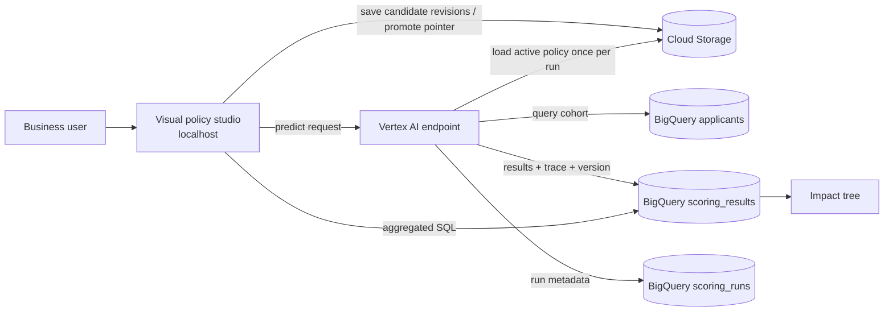

# Architecture

## Runtime flow

The consumer request does not carry applicant features or need to select a policy version. It supplies bounded
execution parameters such as `limit`, an optional idempotency-oriented `run_id`, and `dry_run`.
By default, the runtime resolves `policies/active.json` exactly once and loads the immutable generation referenced
by that pointer, computes its canonical SHA-256, and uses that snapshot for the complete run.
Laboratory requests explicitly include `policy_version`; the runtime snapshots the current candidate revision
instead of using the productive pointer. Dashboard queries then filter by the returned `run_id`, so the visible
result represents one evaluation rather than an accumulation of historical runs.

## Policy publication

Policies are stored as `policies/{policy_id}/{version}.json`. Creating or updating a candidate does
not update the productive pointer. Every candidate save also writes an immutable SHA-addressed
revision under its version; Cloud Storage object generations provide an additional recovery layer.
A separate promotion action freezes the candidate and updates `policies/active.json`. New business
versions use the Cloud Storage `ifGenerationMatch=0` precondition. The mutable
`policies/active.json` pointer contains the object path and its exact GCS generation. Bucket object
versioning provides recovery for pointer changes; application versioning provides business audit.

Before production, add an authenticated approval workflow and persist draft/review/publish events in
an audit table. The POC validates graph references, field names, types, and cycles before publishing.

## Explainability contract

Every result includes:

- `policy_id`, human version, and canonical `policy_sha256`;
- `run_id`, `user_id`, evaluation timestamp, final node, decision and reason code;
- a snapshot of all input features used by the POC;
- ordered `trace_json` steps with observed value, threshold, boolean branch, and next node.

The dashboard unnests `trace_json` in BigQuery to count node visits and transitions. That produces the
"where did the bulk go?" view without re-running historical policies.

## Security boundaries

The browser contains no service-account key. In the current POC, local FastAPI uses the developer's
ADC to invoke Vertex and query dashboard data; credentials never enter the browser or repository.
Vertex uses a dedicated runtime identity with dataset edit access and read-only policy access.

Cloud Run is a future option and has its own dedicated identity in Terraform. The default keeps it
authenticated. If `allow_unauthenticated_ui=true`, anyone could publish a policy; that option is only
present to make the trade-off explicit and should not be used outside a disposable demo.

## POC versus production

An online prediction that scans and writes a bounded BigQuery cohort is convenient for this POC, but
it is a side-effecting batch operation. For large cohorts, keep the same policy engine and contract,
then move orchestration to a Vertex Custom Job or Cloud Run Job. The UI can start the job and poll the
`scoring_runs` table while preserving identical lineage fields.
