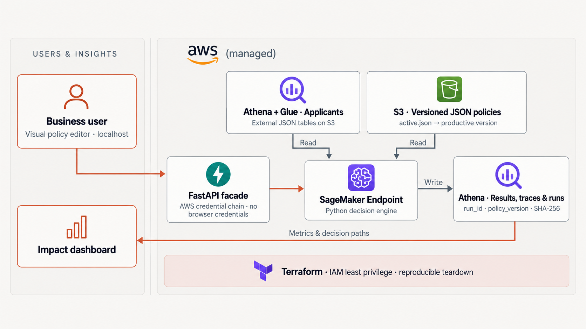

# Porting Credit Policy Studio to AWS

Read [the architecture](architecture.md) first: it describes the runtime flow, the policy publication
model, the explainability contract and the trust boundaries once, for both clouds. This document is
the AWS-specific companion — what each Google Cloud service maps to, and where the mechanism differs.

It describes how the current Google Cloud proof of concept is ported to AWS while
keeping the existing GCP path working. The application already isolates every cloud dependency
behind three seams, so the port adds adapters instead of rewriting the domain.



## Decisions

| Concern | Google Cloud (today) | AWS (target) |
| --- | --- | --- |
| Policy storage | Cloud Storage, object generations | S3 with bucket versioning, conditional writes |
| Warehouse | BigQuery | Athena over S3 (Glue Data Catalog) |
| Scoring runtime | Vertex AI endpoint | SageMaker real-time endpoint |
| Image registry | Artifact Registry + Cloud Build | ECR + local `docker build` |
| Runtime identity | Service account | IAM role |
| Provisioning | Terraform (`infra/`) | Terraform (`infra/aws/`) |

Both clouds coexist. A single setting, `CLOUD_PROVIDER` (`local` | `gcp` | `aws`), selects the
adapter set in `dependencies.py`. No existing GCP code path changes behaviour.

## Seams that already exist

- `PolicyRepository` (Protocol, `repositories.py`) — implemented by `LocalPolicyRepository` and
  `GcsPolicyRepository`. Add `S3PolicyRepository`.
- `Warehouse` (Protocol, `warehouse.py`) — implemented by `MemoryWarehouse` and
  `BigQueryWarehouse`. Add `AthenaWarehouse`.
- `VertexInvoker` (`invoker.py`) — the only caller is `api.py::create_run`. Add `SageMakerInvoker`
  with the same `run(parameters) -> RunSummary` signature.

`engine.py`, `service.py`, `models.py` and `web/` are cloud-agnostic and are not touched.

## 1. Configuration

Add to `Settings` (`config.py`):

```python
cloud_provider: str = "local"  # local | gcp | aws
aws_region: str = "us-east-1"
policy_bucket: str = ""  # reused: GCS bucket name or S3 bucket name
data_bucket: str = ""  # S3 prefix root for applicants/results/runs
glue_database: str = "credit_policy"
athena_workgroup: str = "credit-policy-studio"
athena_output_uri: str = ""  # s3://.../athena-results/
sagemaker_endpoint_name: str = ""
```

`app_env` keeps its current meaning for local development; `cloud_provider` decides which cloud
adapters are constructed when not running locally.

## 2. Policy storage: GCS to S3

Both clouds offer the same two primitives — create-only and replace-if-unchanged writes over
versioned objects — so the repository logic is not duplicated per cloud. `ObjectPolicyRepository`
holds all of it and talks to an `ObjectStore`:

```python
class ObjectStore(Protocol):
    def read(self, key, version=None) -> str: ...  # a pinned version, or the latest
    def create(self, key, payload) -> str: ...  # create-only; FileExistsError on conflict
    def replace(self, key, payload) -> str: ...  # replace-if-unchanged
    def put(self, key, payload) -> str: ...  # unconditional, for the active pointer
    def version_of(self, key) -> str: ...
    def list_direct(self, prefix) -> list[str]: ...  # direct keys plus child prefixes
```

`GcsObjectStore` and `S3ObjectStore` are the only cloud-specific code — about 70 lines each against
165 shared. `tests/test_policy_repository.py` runs the contract against an in-memory store, so the
shared behaviour is covered once instead of once per cloud.

This is not cosmetic. While the two repositories were duplicated, the fix for publishing the first
version before any active pointer exists landed only on the S3 copy; Cloud Storage still resolved
the policy id through `get_active()` and could not bootstrap. Unifying fixed both.

The mapping each store implements:

| GCS behaviour | S3 equivalent |
| --- | --- |
| `blob.generation` | `VersionId` returned by `PutObject` |
| `blob(name, generation=g).download_as_text()` | `GetObject(Key=name, VersionId=g)` |
| `upload_from_string(..., if_generation_match=0)` (create only) | `PutObject(..., IfNoneMatch="*")` |
| `upload_from_string(..., if_generation_match=g)` (unchanged only) | `PutObject(..., IfMatch=etag)` |
| `list_blobs(prefix=...)` | `list_objects_v2(Prefix=..., Delimiter="/")` |

The active pointer object keeps the same shape, with `generation` replaced by `version_id`. Legacy
pointers written by `scripts/publish_policy.sh` still carry `generation` and are read unchanged:

```json
{"policy_id": "...", "version": "...", "object": "policies/.../v2.json", "version_id": "..."}
```

Failed conditional writes raise `PreconditionFailed` / `ConditionalRequestConflict`, which the store
maps to the `FileExistsError` and `FileNotFoundError` the repository already translates to HTTP 409
and 404.

The bucket is created with versioning enabled, public access blocked, SSE-S3 (or KMS) enabled, and
a lifecycle rule that expires noncurrent versions after 20 newer versions, matching the current
Terraform.

## 3. Warehouse: BigQuery to Athena

### Storage layout

Athena reads external tables in the Glue Data Catalog over newline-delimited JSON on S3:

```
s3://<data_bucket>/applicants/applicants.json
s3://<data_bucket>/scoring_results/run_id=<run_id>/<uuid>.json
s3://<data_bucket>/scoring_runs/<run_id>.json
s3://<data_bucket>/athena-results/            # workgroup output
```

`write_results` and `write_run` become a single `PutObject` of newline-delimited JSON, which
replaces BigQuery's `insert_rows_json` streaming inserts. `scoring_results` is partitioned by
`run_id` using **partition projection** (`projection.run_id.type = injected`), so no crawler,
`MSCK REPAIR`, or `ALTER TABLE ADD PARTITION` is needed; every dashboard query already filters by
`run_id`. `scoring_runs` and `applicants` stay unpartitioned.

This deliberately writes one small object per run instead of using an Iceberg table with
`INSERT INTO`. It removes DML, the 262 KB Athena query-size limit on large `trace_json` payloads,
and any table maintenance. If run volume grows, the upgrade path is an Iceberg table plus periodic
compaction — recorded as a `ponytail:` comment in `AthenaWarehouse`.

### Query execution

`AthenaWarehouse` uses `boto3` `athena`:
`start_query_execution` (with `ExecutionParameters` for `?` placeholders, keeping the queries
parameterized exactly as the BigQuery version) → poll `get_query_execution` → `get_query_results`.
One private helper handles submit, poll and row mapping; the four public methods stay thin.

### SQL translation (BigQuery to Trino)

| BigQuery | Trino / Athena |
| --- | --- |
| `` `project.dataset.table` `` | `"credit_policy"."scoring_results"` |
| `@param` | `?` positional parameter |
| `JSON_QUERY_ARRAY(trace_json)` | `CAST(json_parse(trace_json) AS array(json))` |
| `UNNEST(...) AS step` | `CROSS JOIN UNNEST(...) AS t(step)` |
| `JSON_VALUE(step, '$.node_id')` | `json_extract_scalar(step, '$.node_id')` |
| `ANY_VALUE(label)` | `arbitrary(label)` |

Rewritten node query:

```sql
WITH filtered AS (
  SELECT leaf_node_id, decision, trace_json FROM scoring_results WHERE run_id = ?
), visited AS (
  SELECT json_extract_scalar(step, '$.node_id') AS node_id,
         json_extract_scalar(step, '$.label')   AS label
  FROM filtered CROSS JOIN UNNEST(CAST(json_parse(trace_json) AS array(json))) AS t(step)
  UNION ALL
  SELECT leaf_node_id, decision FROM filtered
)
SELECT node_id, arbitrary(label) AS label, COUNT(*) AS count
FROM visited GROUP BY node_id ORDER BY count DESC
```

Rewritten path query:

```sql
SELECT json_extract_scalar(step, '$.node_id')          AS source,
       json_extract_scalar(step, '$.next_node')        AS target,
       json_extract_scalar(step, '$.branch') = 'true'  AS branch,
       COUNT(*) AS count
FROM scoring_results CROSS JOIN UNNEST(CAST(json_parse(trace_json) AS array(json))) AS t(step)
WHERE run_id = ? GROUP BY 1, 2, 3 ORDER BY count DESC
```

`read_applicants` interpolates `LIMIT` as an integer rather than a parameter; the value is already
validated by `PredictionParameters` and Athena does not accept a parameter in every `LIMIT`
position.

The response shape returned to `web/app.js` is unchanged: `total`, `decisions`, `nodes`, `paths`,
`latest_run`.

## 4. Scoring runtime: Vertex AI to SageMaker

SageMaker's container contract is `GET /ping` and `POST /invocations`. The application already
exposes `/ping`. Two changes to the existing app satisfy the contract:

- `api.py`: add `@app.post("/invocations")` to the existing `predict` handler. The
  `{"instances": [...], "parameters": {...}}` request body is kept, so one payload shape serves
  both clouds.
- `Dockerfile`: switch `CMD` to `ENTRYPOINT`. SageMaker starts the container as
  `docker run <image> serve`, which would replace a `CMD` entirely; with an `ENTRYPOINT` the extra
  `serve` argument is harmless. The port comes from `SAGEMAKER_BIND_TO_PORT`, defaulting to `8080`:

```dockerfile
ENTRYPOINT ["sh", "-c", "uvicorn credit_policy_studio.api:app --host 0.0.0.0 --port ${SAGEMAKER_BIND_TO_PORT:-$PORT}"]
```

`SageMakerInvoker` calls `sagemaker-runtime.invoke_endpoint(EndpointName=..., ContentType="application/json", Body=json.dumps({"instances": [{}], "parameters": parameters}))`
and validates `RunSummary` from `predictions[0]`, mirroring `VertexInvoker.run` one to one.
`api.py::create_run` selects the invoker from `cloud_provider` instead of testing
`vertex_endpoint_id` directly.

The local UI keeps calling only `localhost`. Credentials come from the standard boto3 chain (SSO
profile, environment, or instance role), so no key is embedded in HTML or committed.

## 5. Infrastructure (`infra/aws/`)

A separate Terraform root, so the GCP root stays untouched:

- `aws_s3_bucket` for policies — versioning, public access block, SSE, noncurrent-version lifecycle.
- `aws_s3_bucket` for data and Athena output.
- `aws_glue_catalog_database` + three `aws_glue_catalog_table` resources (JSON SerDe, partition
  projection on `scoring_results`), replacing the BigQuery dataset and `infra/schemas/*.json`.
  The existing JSON schema files are the source for the column lists.
- `aws_athena_workgroup` with the output location and result encryption enforced.
- `aws_ecr_repository` with image scanning on push.
- `aws_iam_role` for the SageMaker execution role: read on the policy bucket, read/write on the
  data bucket and Athena output prefix, `athena:StartQueryExecution` / `GetQueryExecution` /
  `GetQueryResults`, `glue:GetDatabase` / `GetTable` / `GetPartitions`, and ECR pull.
- `aws_sagemaker_model`, `aws_sagemaker_endpoint_configuration`, `aws_sagemaker_endpoint` — created
  only when `deploy_endpoint = true`, mirroring how the GCP root defers the billable Vertex replica
  to `make deploy-model`.

`aws_sagemaker_endpoint` is the only always-on cost: about USD 74 per month for `ml.c6i.large`, the
cheapest current-generation x86 hosting instance in `us-east-1`. T2 and T3 are not offered for
SageMaker hosting at all. Graviton (`ml.c8g.medium`, about USD 35 per month) would be cheaper but
needs an arm64 image. The endpoint is behind a variable and has a teardown target so a POC can be
parked.

## 6. Makefile targets

```
aws-tf-init / aws-tf-plan / aws-infra   terraform -chdir=infra/aws ...
aws-image                               docker build + ECR login + push
aws-deploy-endpoint                     create or update the SageMaker endpoint
aws-delete-endpoint                     tear down the billable endpoint
aws-seed                                upload the synthetic cohort JSON to S3
aws-upload-policy                       publish and activate the sample policy on S3
```

`sql/seed_applicants.sql` is replaced on the AWS path by a JSON file uploaded to the `applicants/`
prefix; the fixture rows already exist as `DEMO_APPLICANTS` in `warehouse.py`.

## 7. Dependencies

Neither cloud SDK is a base dependency. Both are extras, so an image built for one cloud does not
carry the other's SDK:

```toml
dependencies = ["fastapi", "pydantic", "pydantic-settings", "uvicorn[standard]"]

[project.optional-dependencies]
aws = ["boto3>=1.35,<2"]
gcp = ["google-cloud-aiplatform", "google-cloud-bigquery", "google-cloud-storage"]
```

The Dockerfile takes `ARG EXTRAS=gcp`, which keeps `gcloud builds submit --tag` working unchanged;
`make aws-image` passes `--build-arg EXTRAS=aws`. Every cloud adapter imports its SDK lazily —
`aws.py` inside its own module, and `GcsPolicyRepository`, `BigQueryWarehouse` and `VertexInvoker`
inside their constructors — so importing `api.py` pulls in neither.

This is not only about image size. With the GCP SDK loaded at module scope, container start took
**15.19 s**; with lazy imports it takes **0.85 s**. On SageMaker Serverless, where a cold start gets
constrained CPU, the slow path exceeded the provisioning window and every endpoint creation failed
with a generic `Request to service failed` and no container logs at all. The AWS image is also
195 MB instead of 438 MB.

## 8. Tests

- `test_s3_policy_repository.py` — `moto` (dev extra) fakes S3; covers publish, conditional-write
  conflict on republish, update-then-activate, and revision lookup by SHA.
- `test_athena_warehouse.py` — asserts the generated SQL and `ExecutionParameters` for the four
  queries against a stubbed Athena client, and that `write_results` produces valid
  newline-delimited JSON at the expected key.
- `test_sagemaker_invoker.py` — stub client, asserts the payload shape and `RunSummary` parsing.

The existing `test_engine.py` and `test_api.py` continue to run against the local/in-memory
adapters and need no change.

## Work order

1. `config.py` settings and `dependencies.py` provider switch (no behaviour change yet).
2. `Dockerfile` `ENTRYPOINT` and the `/invocations` route — safe for both clouds.
3. `S3PolicyRepository` and its tests.
4. `AthenaWarehouse` and its tests.
5. `SageMakerInvoker` and its test.
6. `infra/aws/` Terraform.
7. Makefile targets, `.env.example`, and README/architecture doc updates.

Steps 3, 4 and 5 are independent of each other and can be done in any order or in parallel.
